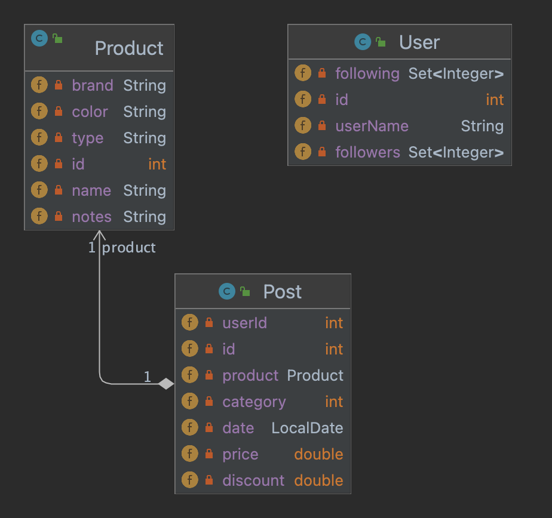

# Bootcamp Sprints: Grupo 5

## Miembros del proyecto

- Gonzalo Barreiro
- Luciano Benavides
- Iván Cano
- Nicolás Chiesa
- José Drozd
- Andrea Ruiz Zorrilla
- Santiago Valdez

## Breve Descripción

El objetivo de este sprint es aplicar los contenidos dados hasta el momento durante el BOOTCAMP MeLi (Git, Java y Spring), con la finalidad de poder implementar una API REST que permita a vendedores y compradores interactuar en un espacio similar a una red social, en el escenario que se plantea a continuación.

## Escenario planteado

Mercado Libre sigue creciendo y para el año que viene  tiene como objetivo empezar a implementar una serie de herramientas que permitan a los compradores y vendedores tener una experiencia totalmente innovadora, en donde el lazo que los una sea mucho más cercano.

La fecha de lanzamiento se aproxima, por lo cual es necesaria la presentación de una versión Beta de lo que va a ser conocido como “SocialMeli”, en donde los compradores van a poder seguir a sus vendedores favoritos y enterarse de todas las novedades que los mismos posteen.

### Sprint 1

Se plantea creación de una API Rest que permita:

1. Poder realizar la acción de “Follow” (seguir) a un determinado usuario
2. Poder realizar la acción de “Unfollow” (dejar de seguir) a un determinado vendedor.
3. Obtener un listado de todos los usuarios que siguen a un determinado vendedor (¿Quién me sigue?)
4. Obtener un listado de todos los vendedores a los cuales sigue un determinado usuario (¿A quién sigo?)
5. Obtener el resultado de la cantidad de usuarios que siguen a un determinado vendedor
6. Dar de alta una nueva publicación.
8. (Individual) Agregar un producto con descuento
9. (individual) Retornar la cantidad de productos con descuento de un determinado usuario.
10. (Individual) Retornar los posteos de un usuario con descuentos.

7. Obtener un listado de las publicaciones realizadas en las últimas dos semanas, por los vendedores que un usuario sigue (para esto tener en cuenta ordenamiento por fecha, publicaciones más recientes primero).

## Metodología de trabajo

El trabajo consistió de 2 estapas claramente diferentes:
- una etapa grupal, en la que se acordó el diseño y se implementó el scaffolding del proyecto.
- una división de tareas por US, que cada miembro del equipo implementó de manera individual, aunque siempre recurriendo a la ayuda de otros miembros.

### Tecnologías utilizadas

Para llevar adelante esta metodología de trabajo, se recurrió a la herramienta de control de versiones Git, y la plataforma en la nube GitHub, lo cual nos permitió trabajar cada uno en las partes asignadas, pudiendo compaginar todo en un solo proyecto, y a su vez afianzar conocimientos en el uso de esta herramienta tan extendida en el mundo del desarrollo.

Para el proyecto se recurrió al lenguaje de programación Java, y el framework Spring, integrando todos los conocimientos vistos a lo largo del Bootcamp en estas tecnologías, así como en el paradigma de programación orientada a objetos, sus principios y patrones de desarrollo.

Para las pruebas de los Endpoints se utilizo *Postman*, una herramienta que permite comprobar el correcto funcionamiento de las API implementadas.

### Diseño

El diseño del proyecto está basado en la arquitectura multicapa vista durante el Bootcamp: capa de controlador, capa de servicios, capa de repositorios, modelado de objetos y DTO de los mismos. Este diseõ no solo pone en práctica los conceptos vistos a lo largo de la capacitación; también hace uso de la arquitectura MVC de Spring, aprovechando el contenedor IOC y la inyección de dependencias a través de anotaciones.

El modelo diseñado incluye 3 objetos: Usuario, Publicación y Producto. Inicialmente se consideró la posibilidad de diseñar una abstracción de usuario que generalizara a los objetos Vendedor y Comprador. Sin embargo, nos decantamos por un modelo similar al que utiliza MELI en la actualidad, en el que cualquier usuario puede ser vendedor y comprador, por lo que, al no hacer distinciones entre estos, no fue necesaria las clases específicas.

La siguiente figura muestra el diagrama UML:



### Implementación

Una vez acordado el modelo, se implementó el scaffolding del proyecto, el cual incluyó los paquetes y las clases base. Se crearon los paquetes *controller*, *service*, *repository*, *model*, *dto* y *exception*.

Se crearon clases de Usuario y Servicio para las capas de controlador, servicio y repositorio, así como las clases de Usuario, Publicación y Producto. A medida que se fueron implementando las API solicitadas se fueron creando los DTO necesarios para su correcto funcionamiento.

### Responsables de cada User Story

- US 001 - Ivan
- US 002 - Jose
- US 003 - Santiago
- US 004 - Nicolas
- US 005 - Luciano
- US 006 - Andrea
- US 007 - Ivan
- US 008 - Jose
- US 009 - Gonzalo

### Pruebas

Cada miembro del equipo fue responsable por la implementación de una US, y por las pruebas de funcionamiento necesarias, para lo cual se valió de la herramienta *Postman*. La colección de pruebas realizadas se muestra en el [siguiente archivo.](postman_collection.json)


## Detalles de los endpoints

#### US 0001: Poder realizar la acción de “Follow” (seguir) a un determinado vendedor

```http
  POST /users/{userId}/follow/{userIdToFollow}
```

| Parámetro | Tipo     | Descripción/Ejemplo               |
| :-------- | :------- | :------------------------- |
| `userId` | `int` | Número que identifica al usuario actual|
| `userIdToFollow` | `int` | Número que identifica al usuario a seguir|

#### US 0002: Obtener el resultado de la cantidad de usuarios que siguen a un determinado vendedor

```http
  GET /users/{userId}/followers/count
```

| Parameter | Type     | Description                       |
| :-------- | :------- | :-------------------------------- |
| `userId`      | `int` | Número que identifica a cada usuario |

#### US 0003: Obtener un listado de todos los usuarios que siguen a un determinado vendedor

```http
  GET /users/{userId}/followers/list
```

| Parameter | Type     | Description                       |
| :-------- | :------- | :-------------------------------- |
| `userId`      | `int` | Número que identifica a cada usuario |

#### US 0004: Obtener un listado de todos los vendedores a los cuales sigue un determinado usuario

```http
  GET /users/{userId}/followed/list
```

| Parameter | Type     | Description                       |
| :-------- | :------- | :-------------------------------- |
| `userId`      | `int` | Número que identifica a cada usuario |


#### US 0005: Dar de alta una nueva publicación

```http
  POST /products/post
```

| Parameter | Type     | Description                       |
| :-------- | :------- | :-------------------------------- |
| `userId`      | `int` | Número que identifica a cada usuario |
| `date`      | `LocalDate` | Número que identifica a cada usuario |
| `product_id`      | `int` | Número que identifica a cada usuario |
| `product_name`      | `String` | Número que identifica a cada usuario |
| `type`      | `String` | Número que identifica a cada usuario |
| `brand`      | `String` | Número que identifica a cada usuario |
| `color`      | `String` | Número que identifica a cada usuario |
| `notes`      | `String` | Número que identifica a cada usuario |
| `category`      | `int` | Número que identifica a cada usuario |
| `price`      | `double` | Número que identifica a cada usuario |

#### US 0006: Obtener un listado de las publicaciones realizadas por los vendedores que un usuario sigue en las últimas dos semanas

```http
  GET /products/followed/{userId}/list
```

| Parameter | Type     | Description                       |
| :-------- | :------- | :-------------------------------- |
| `userId`      | `int` | Número que identifica a cada usuario |

#### US 0007: Poder realizar la acción de “Unfollow” (dejar de seguir) a un determinado vendedor.

```http
  POST /users/{userId}/follow/{userIdToFollow}
```

| Parámetro | Tipo     | Descripción/Ejemplo               |
| :-------- | :------- | :------------------------- |
| `userId` | `int` | Número que identifica al usuario actual|
| `userIdToFollow` | `int` | Número que identifica al usuario a seguir|

#### US 0008: Ordenamiento alfabético ascendente y descendente

```http
  GET /users/{userId}/followers/list?order={orderIndicator}
```
```http
  GET /users/{userId}/followed/list?order={orderIndicator}
```

| Parámetro | Tipo     | Descripción/Ejemplo               |
| :-------- | :------- | :------------------------- |
| `userId` | `int` | Número que identifica al usuario actual|
| `orderIndicator` | `int` | Acepta "name_asc" para indicar orden alfabético ascendente y "name_desc" para indicar orden alfabético descendente.|

*NOTA: Este ordenamiento aplica solo para US-003 y US-004.*


#### US 0009: Ordenamiento por fecha ascendente y descendente

```http
  GET /products/followed/{userId}/list?order={orderIndicator}
```

| Parámetro | Tipo     | Descripción/Ejemplo               |
| :-------- | :------- | :------------------------- |
| `userId` | `int` | Número que identifica al usuario actual|
| `orderIndicator` | `int` | Acepta "date_asc" para indicar orden alfabético ascendente y "date_desc" para indicar orden alfabético descendente.|

*NOTA: Este ordenamiento aplica solo para la US-006.*

### Agradecimientos

En primer lugar, los miembros argentinos del grupo agradecen a Lionel Messi por traer la copa.

En segunda instancia, agradecer a nuestro Scrum Master, Adrián Cáceres, así como a Johanna Tabella y el resto del equipo de Digital House por su disposición y paciencia a lo largo del Bootcamp.
