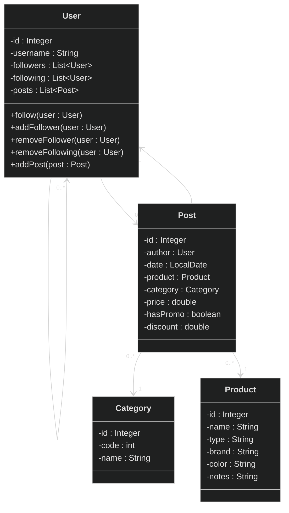

## Modelo

```mermaid
%%{init: {'theme': 'dark'}}%%
classDiagram
    User --> "0..*" User
    User --> "0..*" Post
    Post --> "1" User
    Post "0..*" --> "1" Category
    Post "0..*" --> "1" Product
    
    class User {
        -id : Integer
        -username : String
        -followers : List~User~
        -following : List~User~
        -posts : List~Post~
        +follow(user : User)
        +addFollower(user : User)
        +removeFollower(user : User)
        +removeFollowing(user : User)
        +addPost(post : Post)
    }
    
    class Post {
        -id : Integer
        -author : User
        -date : LocalDate
        -product : Product
        -category : Category
        -price : double
        -hasPromo : boolean
        -discount : double
    }
    
    class Category {
        -id : Integer
        -code : int
        -name : String
    }
    
    class Product {
        -id : Integer
        -name : String
        -type : String
        -brand : String
        -color : String
        -notes : String
    }
        
```