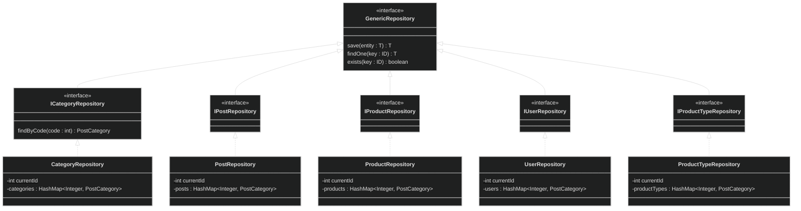

## Repositorios custom

Repositorios realizados con fines didácticos.
Su interfaz intenta asemejarse lo más posible a la que luego será utilizada.

```mermaid
%%{init: {'theme': 'dark'}}%%
classDiagram-v2
    
    GenericRepository <|-- ICategoryRepository
    GenericRepository <|-- IPostRepository
    GenericRepository <|-- IProductRepository
    GenericRepository <|-- IUserRepository
    GenericRepository <|-- IProductTypeRepository
    ICategoryRepository <|.. CategoryRepository
    IPostRepository <|.. PostRepository
    IProductRepository <|.. ProductRepository
    IUserRepository <|.. UserRepository
    IProductTypeRepository <|.. ProductTypeRepository
    
    class GenericRepository~T, ID~ {
        <<interface>>
        save(entity : T)T
        findOne(key : ID)T
        exists(key : ID)boolean
    }
    
    <<interface>> IPostRepository
    
    <<interface>> IProductRepository
    
    <<interface>> IProductTypeRepository
    
    <<interface>> IUserRepository
    
    class ICategoryRepository {
        <<interface>>
        findByCode(code : int)PostCategory
    }
    
    class CategoryRepository {
        -int currentId$
        -categories : HashMap~Integer, PostCategory~
    }
    
    class PostRepository {
        -int currentId$
        -posts : HashMap~Integer, PostCategory~
    }
    
    class ProductRepository {
        -int currentId$
        -products : HashMap~Integer, PostCategory~
    }
    
    class ProductTypeRepository {
        -int currentId$
        -productTypes : HashMap~Integer, PostCategory~
    }
    
    class UserRepository {
        -int currentId$
        -users : HashMap~Integer, PostCategory~
    }
    
```