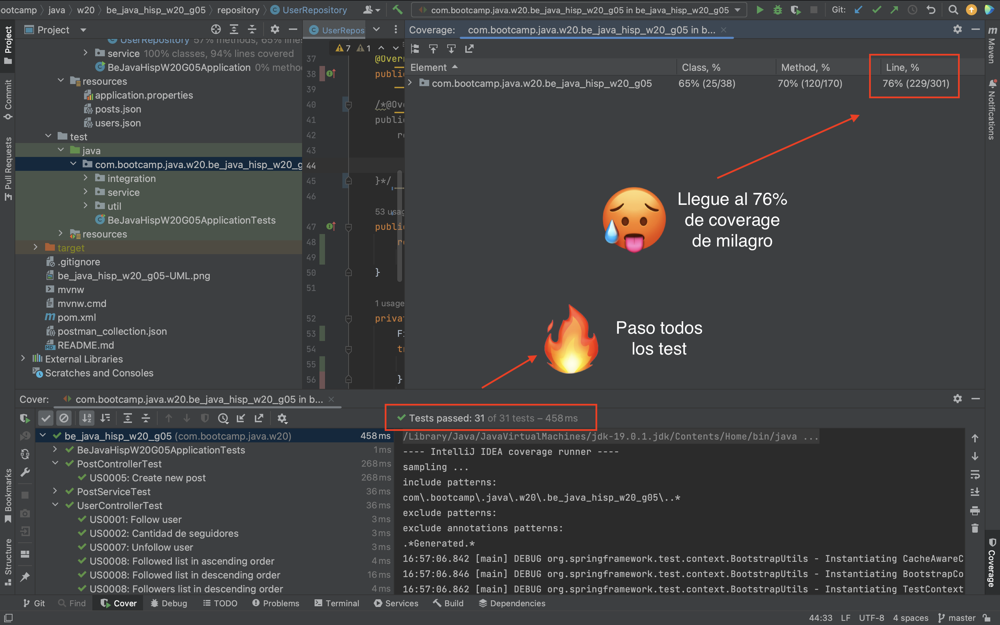

# Sprint II : Grupo 5

## Breve Descripción

El objetivo de este sprint es aplicar los contenidos dados hasta el momento durante la fase de testing (Validaciones, Testing unitarios, Testing de integracion, Code coverage), con la finalidad de poder implementar test que nos ayuden a poder detectar bugs y vulnerabilidades antes de tiempo.

## Miembros de el proyecto
 Gonzalo Barreiro
- Luciano Benavides
- Iván Cano
- Nicolás Chiesa
- José Drozd
- Andrea Ruiz Zorrilla
- Santiago Valdez

## Escenario planteado

Mercado Libre sigue creciendo y para el año que viene  tiene como objetivo empezar a implementar una serie de herramientas que permitan a los compradores y vendedores tener una experiencia totalmente innovadora, en donde el lazo que los una sea mucho más cercano.

La fecha de lanzamiento se aproxima, por lo cual es necesaria la presentación de una versión Beta de lo que va a ser conocido como “SocialMeli”, en donde los compradores van a poder seguir a sus vendedores favoritos y enterarse de todas las novedades que los mismos posteen.

## Descripción de US, Validaciones, Casos de Test.

Descripcion de User Stories.

* US-0001: Poder realizar la acción de “Follow” (seguir) a un determinado vendedor
* US-0002: Obtener el resultado de la cantidad de usuarios que siguen a un determinado vendedor
* US-0003: Obtener un listado de todos los usuarios que siguen a un determinado vendedor (¿Quién me sigue?)
* US-0004: Obtener un listado de todos los vendedores a los cuales sigue un determinado usuario (¿A quién sigo?)
* US-0005: Dar de alta una nueva publicación.
* US-0006: Obtener un listado de las publicaciones realizadas por los vendedores que un usuario sigue en las últimas dos semanas (para esto tener en cuenta ordenamiento por fecha, publicaciones más recientes primero).
* US-0007: Poder realizar la acción de “Unfollow” (dejar de seguir) a un determinado vendedor.
* US-0008: Ordenamiento alfabético ascendente y descendente.
* US-0009: Ordenamiento por fecha ascendente y descendente.

## Tests Unitarios

| Test      | Situaciones de entrada    | Comportamiento Esperado    |
| :-------- | :------------------------ | :------------------------- |
| `T-0001`  | Verificar que el usuario a seguir exista. **(US-0001)** | **Se cumple:** Permite continuar con normalidad. **No se cumple:** Notifica la no existencia mediante una excepción. |
| `T-0002`  | Verificar que el usuario a dejar de seguir exista. **(US-0007)** | **Se cumple:** Permite continuar con normalidad. **No se cumple:** Notifica la no existencia mediante una excepción. |
| `T-0003`  | Verificar que el tipo de ordenamiento alfabético exista **(US-0008)** | **Se cumple:** Permite continuar con normalidad. **No se cumple:** Notifica la no existencia mediante una excepción. |
| `T-0004`  | Verificar el correcto ordenamiento ascendente y descendente por nombre. **(US-0008)** | Devuelve la lista ordenada según el criterio solicitado |
| `T-0005`  | Verificar que el tipo de ordenamiento por fecha exista **(US-0009)** | **Se cumple:** Permite continuar con normalidad. **No se cumple:** Notifica la no existencia mediante una excepción. |
| `T-0006`  | Verificar el correcto ordenamiento ascendente y descendente por fecha. **(US-0009)** | Verificar el correcto ordenamiento ascendente y descendente por fecha. **(US-0009)** |
| `T-0007`  | Verificar que la cantidad de seguidores de un determinado usuario sea correcta. **(US-0002)** | Devuelve el cálculo correcto del total de la cantidad de seguidores que posee un usuario. |
| `T-0008`  | Verificar que la consulta de publicaciones realizadas en las últimas dos semanas de un determinado vendedor sean efectivamente de las últimas dos semanas. **(US-0006)** | Devuelve únicamente los datos de las publicaciones que tengan fecha de publicación dentro de las últimas dos semanas a partir del día de la fecha. |

## Responsables de cada unit test.
- T0001 - Andrea
- T0002 - Andrea
- T0003 - José
- T0004 - Iván
- T0005 - Santiago
- T0006 - Gonzalo
- T0007 - Luciano
- T0008 - Nicolás

## Metodología de trabajo

El trabajo consistió de 2 estapas claramente diferentes:
- una etapa grupal, en la que se acordó el diseño y se implementó el scaffolding del proyecto.
- una división de tareas por US, que cada miembro del equipo implementó de manera individual, aunque siempre recurriendo a la ayuda de otros miembros.

## Objetivos
El objetivo de este desafío es aplicar los contenidos dados hasta el momento durante el BOOTCAMP (Git, Java, Spring y Testing), haciendo principal hincapié en las validaciones y tipos de testing que pueden ser utilizados a partir de un enunciado propuesto, una especificación de requerimientos y documentación técnica.

## Agradecimientos
Agradecer a nuestro Scrum Master, Adrián Cáceres, así como a Johanna Tabella y el resto del equipo de Digital House por su disposición y paciencia a lo largo del Bootcamp.

## Desarrollo individual
Se agregaron algunos test de integración para UserController y PostController logrando un code coverage del 76%.

_Captura de la IDE después de correr todos los test con code coverage._

