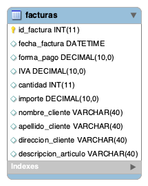

## Escenario
Luego de un análisis realizado en un sistema de facturación, se ha detectado un mal diseño en la base de datos. La misma, cuenta con una tabla facturas que almacena datos de diferente naturaleza.
Como se puede observar, la tabla cuenta con datos que podrían ser normalizados y separados en diferentes entidades.

## Ejercicio

### 1FN
Partimos de la base que la tabla cumple con la primera forma normal ya que no hay columnas repetidas y se respeta la atomicidad de los datos.

### 2FN
En el primer paso aplicamos reglas de normalización para alcanzar la segunda forma normal (2FN), eliminando las columnas que no dependen de la clave principal.

Para esto separamos de la tabla de facturas las columnas que corresponden a datos del cliente y los ubicamos en su propia tabla.

Hacemos lo propio con las columnas que se corresponden a los artículos que puedan integrar una factura.

Notar que agregamos columnas de id tanto para los clientes como los artículos, de manera que todos los atributos no clave dependan por completo de la clave de cada tabla.

### 3FN

Por último para normalizar nuestras nuevas tablas y alcanzar la tercera forma normal (3FN) vamos a crear tablas intermedias y relacionar todas las existentes.

En cuanto a las facturas, las relacionamos con cardinalidad N a N con artículos. De manera que creamos una tabla intermedia para relacionar cada id de artículo con una o varias facturas.

Luego, consideramos que un cliente puede tener varias facturas a su nombre, por lo que dotamos a las facturas de una clave foránea que apunte al cliente hacia el que fue emitida.

