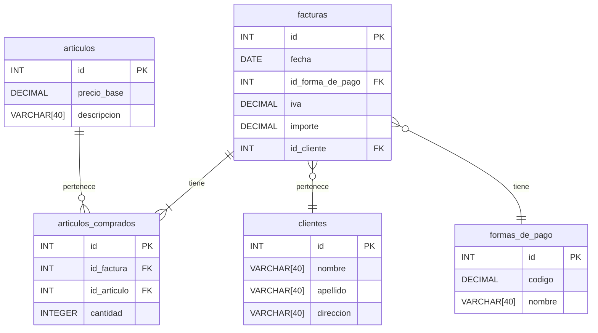

## Decisiones:
#### Facturas
- Decidí conservar en la tabla factura las columnas directamente relacionadas con la misma.
- Agregué las `FK` a las nuevas tablas.

#### Artículos comprados
- En el caso de los artículos considero que es algo que debería persistirse aparte,
puesto que un artículo en sí es algo que puede repetirse en varias facturas y
una factura puede tener varios artículos. Para representar esto cree la tabla intermedia
`articulos_comprados` que además indica la cantidad comprada.

#### Artículos
- La tabla `articulos` con la descripción que se mostraba en la tabla desnormalizada.
- Agregué la columna precio base, que tendría bastante sentido en este dominio.

#### Formas de pago
- Consideré que las formas de pago disponibles deberían persistirse para mantener mayor
consistencia.
- Agregué una columna nombre que describe la forma de pago.
- Agregué un código haciendo referencia a la columna que antes se encontraba en la factura
debido a que desconozco si hay algún estandar de ese estilo para identificar medios de pago/para
poder mantener la API previa.

#### Clientes
- La tabla `clientes` contiene todos los datos de los clientes a quienes pertenecen las facturas.