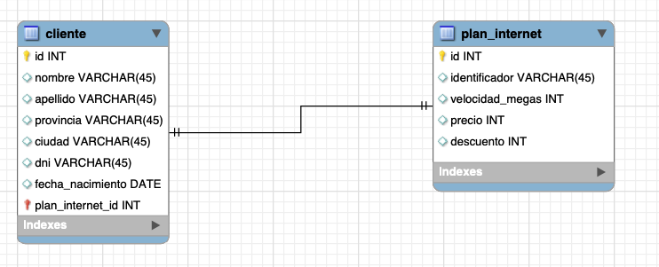

## Ejercicio 1

## Ejercicio 2

- ¿Cuál es la primary key para la tabla de clientes? Justificar respuesta

_La PK de la tabla de clientes es ID, es el identificador único que corresponde a dicha tabla._

- ¿Cuál es la primary key para la tabla de planes de internet? Justificar respuesta.

_La PK de la tabla de clientes es ID, es el identificador único que corresponde a dicha tabla._

- ¿Cómo serían las relaciones entre tablas? ¿En qué tabla debería haber foreign key? ¿A qué campo de qué tabla hace referencia dicha foreign key? Justificar respuesta.

_Cada cliente tiene necesariamente un plan de internet, por lo que en la tabla de clientes hay una FK a la tabla de planes_internet, hace referencia al ID de ésta._

## Ejercicio 3

- Incorporar 10 registros en la tabla de clientes y 5 en la tabla de planes de internet.
- Realizar las asociaciones/relaciones correspondientes entre estos registros.

~~~~sql
INSERT INTO plan_internet (identificador, velocidad_megas, precio, descuento) VALUES ("P-1", 10, 1000, 5);
INSERT INTO plan_internet (identificador, velocidad_megas, precio, descuento) VALUES ("P-2", 20, 2000, 5);
INSERT INTO plan_internet (identificador, velocidad_megas, precio, descuento) VALUES ("P-3", 50, 5000, 10);
INSERT INTO plan_internet (identificador, velocidad_megas, precio, descuento) VALUES ("P-4", 10, 7000, 10);
INSERT INTO plan_internet (identificador, velocidad_megas, precio, descuento) VALUES ("P-5", 300, 8500, 15);
~~~~

~~~~sql
INSERT INTO cliente (nombre, apellido, provincia, ciudad, dni, fecha_nacimiento, plan_internet_id) VALUES ("Pedro", "Lopez", "Cordoba", "Cordoba", "32.123.123", "2000-10-10", 1);
INSERT INTO cliente (nombre, apellido, provincia, ciudad, dni, fecha_nacimiento, plan_internet_id) VALUES ("Pedro", "Gonzalez", "Cordoba", "Colon", "22.123.123", "1950-10-10", 1);
INSERT INTO cliente (nombre, apellido, provincia, ciudad, dni, fecha_nacimiento, plan_internet_id) VALUES ("Juan", "Gonzalez", "Cordoba", "Union", "42.123.123", "1990-10-10", 2);
INSERT INTO cliente (nombre, apellido, provincia, ciudad, dni, fecha_nacimiento, plan_internet_id) VALUES ("Juana", "Gomez", "Cordoba", "Urquiza", "32.323.123", "1991-10-10", 3);
INSERT INTO cliente (nombre, apellido, provincia, ciudad, dni, fecha_nacimiento, plan_internet_id) VALUES ("Juanita", "Perez", "Cordoba", "Urquiza", "32.343.123", "1992-10-10", 4);
INSERT INTO cliente (nombre, apellido, provincia, ciudad, dni, fecha_nacimiento, plan_internet_id) VALUES ("Jose", "Demar", "Cordoba", "Urquiza", "32.343.666", "1994-10-10", 5);
INSERT INTO cliente (nombre, apellido, provincia, ciudad, dni, fecha_nacimiento, plan_internet_id) VALUES ("Josefina", "Demarco", "Cordoba", "Urquiza", "32.343.656", "1995-10-10", 5);
INSERT INTO cliente (nombre, apellido, provincia, ciudad, dni, fecha_nacimiento, plan_internet_id) VALUES ("Jose", "Fernandez", "Cordoba", "Luque", "32.444.656", "1997-10-10", 4);
INSERT INTO cliente (nombre, apellido, provincia, ciudad, dni, fecha_nacimiento, plan_internet_id) VALUES ("Pedro", "Raste", "Neuquen", "Cipo", "32.234.656", "1997-10-10", 4);
INSERT INTO cliente (nombre, apellido, provincia, ciudad, dni, fecha_nacimiento, plan_internet_id) VALUES ("Manuel", "Di Estefano", "Neuquen", "Cipo", "33.334.333", "1999-10-10", 2);
~~~~

## Ejercicio 4

Plantear 10 consultas SQL que se podrían realizar a la base de datos. Expresar las sentencias.

- Obtener nombre y apellido de clientes de Cordoba

~~~~sql
SELECT nombre, apellido FROM cliente WHERE provincia = "cordoba";
~~~~

- Obtener nombre y apellido de los que nacieron después de 1995

~~~~sql
SELECT nombre, apellido FROM cliente WHERE YEAR(fecha_nacimiento) > 1995;
~~~~

- Obtener clientes que tengan el plan más caro, es decir el 5

~~~~sql
SELECT * FROM cliente WHERE plan_internet_id = 5;
~~~~

- Mostrar los planes ordenados por descuento

~~~~sql
SELECT * FROM plan_internet ORDER BY descuento DESC;
~~~~

- Mostrar planes que tengan más de 50 mb

~~~~sql
SELECT * FROM plan_internet WHERE velocidad_megas > 50;
~~~~

- Mostrar codigo de planes con la columna usando un alias

~~~~sql
SELECT identificador AS Codigo_identificador FROM plan_internet;
~~~~
- Mostrar nombre de clientes que tengan los planes 1 o 2

~~~~sql
SELECT nombre FROM cliente WHERE plan_internet_id IN (1,2);
~~~~
- Mostrar nombre completo (concatenarlo) a los de clientes de Neuquen

~~~~sql
SELECT CONCAT(nombre, ' ', apellido) AS nombre_completo FROM cliente WHERE provincia = "neuquen";
~~~~
- Mostrar nombre y apellido de cliente ordenado por fecha de nacimiento

~~~~sql
SELECT nombre, apellido FROM cliente ORDER BY fecha_nacimiento;
~~~~

- Mostrar los primeros 3 clientes
~~~~sql
SELECT * FROM cliente LIMIT 3;
~~~~
