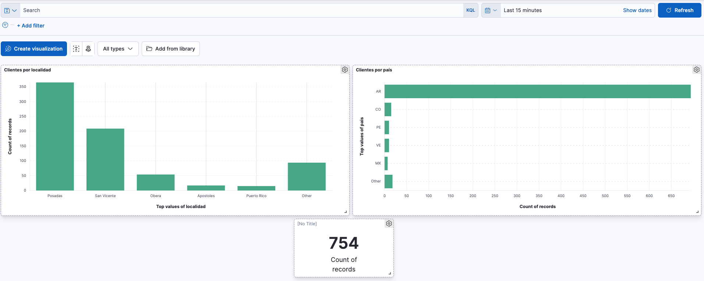
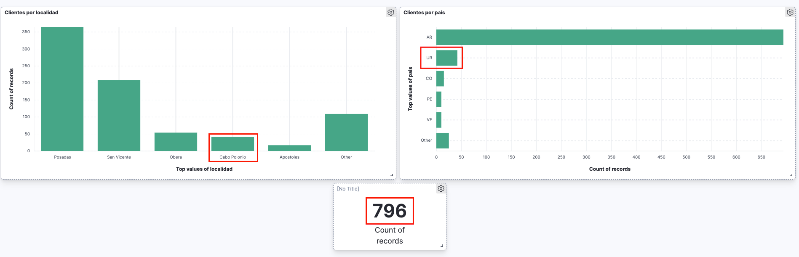

## Base de datos - Clientes

### Dashboard inicial

- Se creó el siguiente dashboard básico para mostrar datos de los clientes, referidos al país y a las localidades



- Obteniendo los clientes de México por get request

```
curl -XGET "http://localhost:9200/clientes/_search" -H 'Content-Type: application/json' -d'
{
  "query": {
    "match": {
      "pais": "MX"
    }
  }
}'
```

```json
{
   "took":1,
   "timed_out":false,
   "_shards":{
      "total":1,
      "successful":1,
      "skipped":0,
      "failed":0
   },
   "hits":{
      "total":{
         "value":7,
         "relation":"eq"
      },
      "max_score":4.6118145,
      "hits":[
         {
            "_index":"clientes",
            "_type":"_doc",
            "_id":"x-2w3oUBp_ssibb8X-_5",
            "_score":4.6118145,
            "_source":{
               "numero":"4",
               "apellido":"Guarneros Rivera",
               "localidad":"Posadas",
               "nombre":"Alfredo Sebastian",
               "pais":"MX"
            }
         },
         {
            "_index":"clientes",
            "_type":"_doc",
            "_id":"Zu2w3oUBp_ssibb8X_D6",
            "_score":4.6118145,
            "_source":{
               "numero":"163",
               "apellido":"Sanrom�n",
               "localidad":"Posadas",
               "nombre":"M�nica",
               "pais":"MX"
            }
         },
         {
            "_index":"clientes",
            "_type":"_doc",
            "_id":"eu2w3oUBp_ssibb8X_D6",
            "_score":4.6118145,
            "_source":{
               "numero":"183",
               "apellido":"Castillo",
               "localidad":"Posadas",
               "nombre":"Jose",
               "pais":"MX"
            }
         },
         {
            "_index":"clientes",
            "_type":"_doc",
            "_id":"fO2w3oUBp_ssibb8X_D6",
            "_score":4.6118145,
            "_source":{
               "numero":"185",
               "apellido":"Cruz Xicale",
               "localidad":"Posadas",
               "nombre":"Felipe Adbeel",
               "pais":"MX"
            }
         },
         {
            "_index":"clientes",
            "_type":"_doc",
            "_id":"qu2w3oUBp_ssibb8X_D6",
            "_score":4.6118145,
            "_source":{
               "numero":"231",
               "apellido":"Juan",
               "localidad":"Posadas",
               "nombre":"Carlos",
               "pais":"MX"
            }
         },
         {
            "_index":"clientes",
            "_type":"_doc",
            "_id":"QO2w3oUBp_ssibb8X_H6",
            "_score":4.6118145,
            "_source":{
               "numero":"381",
               "apellido":"Barcenas Gutierres",
               "localidad":"San Pedro",
               "nombre":"Michelle",
               "pais":"MX"
            }
         },
         {
            "_index":"clientes",
            "_type":"_doc",
            "_id":"Je2w3oUBp_ssibb8X_L8",
            "_score":4.6118145,
            "_source":{
               "numero":"610",
               "apellido":"Garcia",
               "localidad":"San Vicente",
               "nombre":"Jesus",
               "pais":"MX"
            }
         }
      ]
   }
}
```

### Dashboard luego de insertar datos

- Se agregan muchos usuarios a través de la UI o por CURL que sean de Uruguay y de Cabo Polonio

```
curl -XPOST "http://localhost:9200/clientes/_doc" -H 'Content-Type: application/json' -d'
{
  "nombre" : "Ezequiel",
  "apellido": "Perez",
  "pais": "UR",
  "localidad": "Cabo Polonio"
}'
```

- Podemos observar en el dashboard que se ha agregado a muchos clientes de Uruguay y de la Localidad de Cabo Polonio, a través del gráfico por País, localidad y registros totales.

