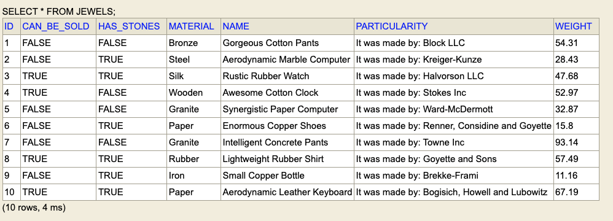

## Ejercicio Joyería 'Las Perlas'

Se cumplen con los requisitos indicados, quería mencionar que se trabajó con H2 como base de datos, por lo que generé una [clase](src/main/java/com/example/lasperlas/init/JewelDataAdder.java) que pueda generar información al momento de cargar el proyecto.

A continuación se muestra un ejemplo de lo que se ha generado cuando corrí la aplicación

